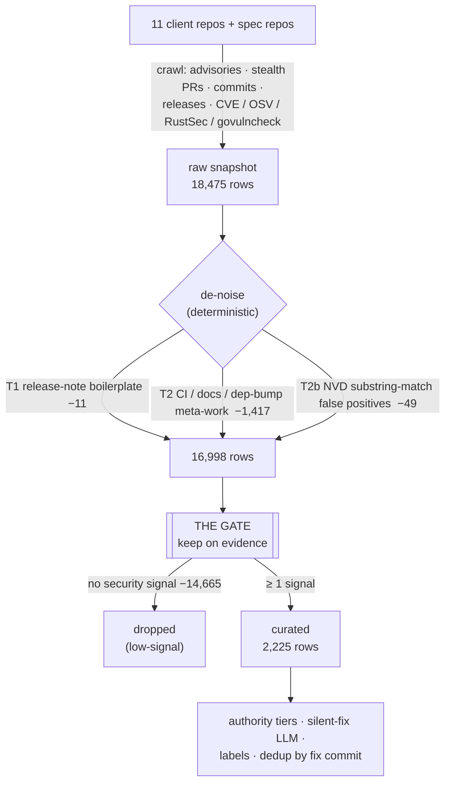
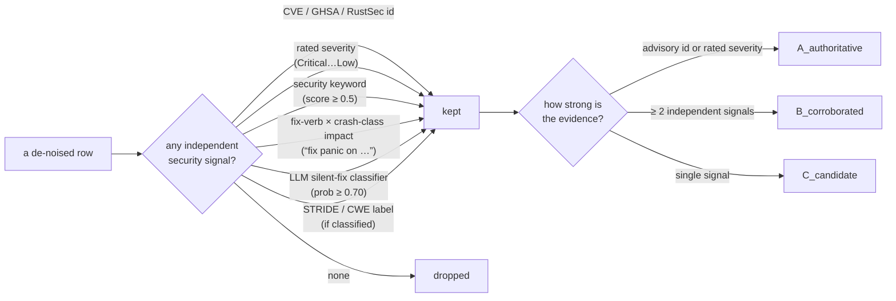

# ethereum-vuln-dataset

A curated corpus of **past security fixes** from the eleven production Ethereum
clients (five execution-layer, six consensus-layer). Every row is one historical
vulnerability fix — a merged PR, commit, advisory, or CVE — normalized to a
single schema, scored for security relevance, and tiered by evidence strength.

It is built for training and evaluating spec-compliance / audit tooling:
> *given the code state just before this fix, would the tool have caught the bug?*

Because Ethereum clients **silently patch** most vulnerabilities (no CVE, vague
commit message), the hard part is separating real fixes from the flood of
refactors, dep-bumps and release notes. That separation — **the gate** — is what
this README explains.

```python
import pandas as pd
df = pd.read_parquet("data/ethereum_vulns.parquet")   # or data/ethereum_vulns.csv

df[df.authority_tier != "C_candidate"]      # the essential slice (1,808 rows)
df[df.confidence == "high"]                 # strongest evidence only
```

**Browse it on GitHub:** [`data/ethereum_vulns.preview.csv`](data/ethereum_vulns.preview.csv)
renders as a table (key columns). Full data with inline pre/post code: [`ethereum_vulns.csv`](data/ethereum_vulns.csv) or the `.parquet`.

*(A HuggingFace `datasets` mirror under [`NyxFoundation/`](https://huggingface.co/NyxFoundation) is planned.)*

## Dataset at a glance

| | rows |
|---|---:|
| raw snapshot (all clients) | 18,475 |
| curated (security-only) | **2,225** |
| └ essential slice (tier A ∪ B) | **1,808** |
| by tier | A_authoritative 235 · B_corroborated 1,573 · C_candidate 417 |
| by confidence | high 337 · medium 1,542 · low 454 |
| by severity | Critical 3 · High 63 · Medium 60 · Low 21 · Info 853 · Unrated 1,333 |

## How the corpus is built



**"Gate-dropped"** = a row that survived de-noising but for which **no independent
security signal fired**. These 14,665 rows are things like plain refactors,
feature PRs, and non-security commits the keyword crawl happened to touch — kept
out of the curated set. (A learned LLM pass rescues the ones that *are* silent
fixes; see [Silent-fix detection](#silent-fix-detection).)

## The gate — what decides "in or out"

The gate keeps a row if **any one** independent signal fires (union = high
recall), then **tiers** it by how much evidence stacked up. No single heuristic
is trusted alone.



| Tier | Meaning | Use it when |
|---|---|---|
| **A_authoritative** | carries an advisory id or an advisory-rated severity — a confirmed vulnerability | you want ground truth |
| **B_corroborated** | no id, but ≥ 2 independent signals agree (e.g. strong keyword **+** sensitive subsystem **+** LLM says silent-fix) | the default high-precision slice |
| **C_candidate** | a single signal fired — broad recall, noisier | you want maximum coverage |

The **essential slice** = A ∪ B. Each row also carries `n_signals` (how many
fired) and `confidence` (high/medium/low) so you can threshold further.

Pre-gate de-noising, in order (`pipeline/build_security_dataset.py`):

| Stage | Drops | Rationale |
|---|---|---|
| **T1** | release-note / urgency-template rows | a severity from a release header is never trusted (an old build read Nimbus's *"critical update required"* template as ~95 phantom criticals) |
| **T2** | CI / docs / dep-bump meta-work (title-anchored) | not a client-code vulnerability; rows citing an advisory id / strong vuln language / rated severity are protected |
| **T2b** | NVD substring-match false positives | `crawl_cve` matched "geth" inside `gethostbyaddr`, "Gether Technology", Linux `usb: g…` — glibc/X.Org/kernel CVEs, not client bugs |

## Silent-fix detection

Ethereum clients patch ~98–100% of vulnerabilities *silently*. Two research-backed
methods recover them (full write-up: [`docs/silent_fix_detection.md`](docs/silent_fix_detection.md)):

- **Patch backlinking** — start from a confirmed advisory (OSV/GHSA) and extract
  the exact fixing commit/version (`fix_commit`). Deterministic, high precision.
- **Training-free LLM classifier** (`collection/llm_classify_fixes.py`) — an
  LLM4VFD-style Chain-of-Thought over *diff + dev-artifacts + touched subsystem*,
  no fine-tuning. Runs on `gemma4:31b` (chosen by an [80-item eval sweep](docs/model_evaluation.md):
  F1 0.872, precision 0.895), or Claude / a local Ollama model. Diffs are served
  rate-limit-free from bare git clones by `collection/local_diffs.py`. This pass
  admitted **+453** silent fixes the deterministic gate had missed.

## Clients

Fixes are sourced from each client's own public repository.

| Client | Layer | Language | Repository |
|---|---|---|---|
| Geth | execution | Go | [`ethereum/go-ethereum`](https://github.com/ethereum/go-ethereum) |
| Nethermind | execution | C# | [`NethermindEth/nethermind`](https://github.com/NethermindEth/nethermind) |
| Besu | execution | Java | [`hyperledger/besu`](https://github.com/hyperledger/besu) |
| Erigon | execution | Go | [`erigontech/erigon`](https://github.com/erigontech/erigon) |
| Reth | execution | Rust | [`paradigmxyz/reth`](https://github.com/paradigmxyz/reth) |
| Lighthouse | consensus | Rust | [`sigp/lighthouse`](https://github.com/sigp/lighthouse) |
| Lodestar | consensus | TypeScript | [`ChainSafe/lodestar`](https://github.com/ChainSafe/lodestar) |
| Nimbus | consensus | Nim | [`status-im/nimbus-eth2`](https://github.com/status-im/nimbus-eth2) |
| Prysm | consensus | Go | [`prysmaticlabs/prysm`](https://github.com/prysmaticlabs/prysm) |
| Teku | consensus | Java | [`Consensys/teku`](https://github.com/Consensys/teku) |
| Grandine | consensus | Rust | [`grandinetech/grandine`](https://github.com/grandinetech/grandine) |

Plus [`ethereum/consensus-specs`](https://github.com/ethereum/consensus-specs) and
[`ethereum/execution-specs`](https://github.com/ethereum/execution-specs) for
spec-divergence fixes.

## Schema

| Column | Description |
|---|---|
| `id` | stable row id |
| `source_platform` | client slug (`geth`, `lighthouse`, …) |
| `issue_id` | PR / issue / commit / advisory id |
| `severity` | `Critical` / `High` / `Medium` / `Low` / `Info` / `Unrated` |
| `title`, `description` | fix text (verbatim from the client's public repo) |
| `source_url` | link to the upstream fix |
| `label` | **protocol area of the bug** (e.g. `fork-choice`, `beacon-chain:attestation`, `precompiles`, `blobs`) — see [`docs/label_design.md`](docs/label_design.md) |
| `root_cause` | why it was a bug (`missing_bounds_check`, `integer_overflow_underflow`, `consensus_divergence`, …) |
| `attack_path` | how it's triggered (`malicious_block`, `malicious_tx`, `malicious_p2p_message`, …) |
| `pre_fix_code` / `post_fix_code` | **inline** before/after code as JSON `[{file, hunks:[{start_line, code}]}]` (multi-file) |
| `files_changed` | JSON list of changed paths |
| `fix_commit` | fixing commit SHA (`/commit/` URL, resolved PR head, or OSV backlink) |
| `introduced_in_commit` | parent of the fix commit (last state with the bug present) |
| `security_score` | keyword relevance score, 0.0–1.0 |
| `silent_fix_prob` | learned classifier's p(silent fix), when classified |
| `authority_tier` | `A_authoritative` / `B_corroborated` / `C_candidate` |
| `n_signals` | number of independent signals that fired |
| `confidence` | `high` / `medium` / `low` |
| `stride`, `cwe_top25` | STRIDE / CWE-Top-25 label (optional LLM pass) or `Other` / `N/A` |

## Reproduce

The curated table is derived **deterministically** from the raw snapshot — no
network, no API key:

```bash
uv run python pipeline/build_security_dataset.py \
  --in  data/raw/train.classified.parquet \
  --out data/ethereum_vulns.parquet \
  --silent-fix-csv data/silent_fix_llm.csv      # optional: fold in the LLM signal
uv run --with pytest python -m pytest tests/ -q
```

Re-collecting the raw snapshot (network-bound) or re-running the LLM
classification is documented under [`docs/`](docs/) and `collection/run_pipeline.sh`.

## Repository layout

```
data/            ethereum_vulns.parquet (curated) · raw/ · silent_fix_llm.csv · manifest.json
pipeline/        build_security_dataset.py  — deterministic gate + tiering
collection/      crawlers, local_diffs.py, llm_classify_fixes.py, run_pipeline.sh
tests/           quality gates (schema, no-boilerplate, every-row-has-a-signal)
docs/            BUILD_REPORT · IMPROVEMENT_LOG · silent_fix_detection · model_evaluation · collection
```

## Documentation

- [`docs/security_report.md`](docs/security_report.md) — 🔎 **Field guide for security researchers** — the bug-bounty severity model as premise, the severity-realization map (what pays → where to look), recurring anti-patterns, cross-client variant analysis, case studies, and a hunting playbook
- [`docs/analysis.md`](docs/analysis.md) — **what the data says** (silent-fix majority, availability-first vuln profile, cross-language diversity), read through the dataset-research literature
- [`docs/limitations.md`](docs/limitations.md) — **honest inventory of coverage gaps & caveats** (read before relying on the data)
- [`docs/severity_labeling.md`](docs/severity_labeling.md) — **methodology**: LLM severity estimation against the bug-bounty model (decompose → map → calibrate)
- [`docs/label_design.md`](docs/label_design.md) — the `label` / `root_cause` / `attack_path` / pre+post-code design, tied to the specs
- [`docs/silent_fix_detection.md`](docs/silent_fix_detection.md) — research background + the algorithm
- [`docs/model_evaluation.md`](docs/model_evaluation.md) — LLM model benchmark (accuracy + speed)
- [`docs/BUILD_REPORT.md`](docs/BUILD_REPORT.md) — per-stage before/after for the current snapshot
- [`docs/IMPROVEMENT_LOG.md`](docs/IMPROVEMENT_LOG.md) — the full iteration ledger
- [`docs/collection.md`](docs/collection.md) — the crawler layer

## License

Data: [CC-BY-4.0](LICENSE), sourced from each client's own public repository
(`title` / `description` verbatim from those public sources). Code under
`collection/` and `pipeline/`: MIT.
