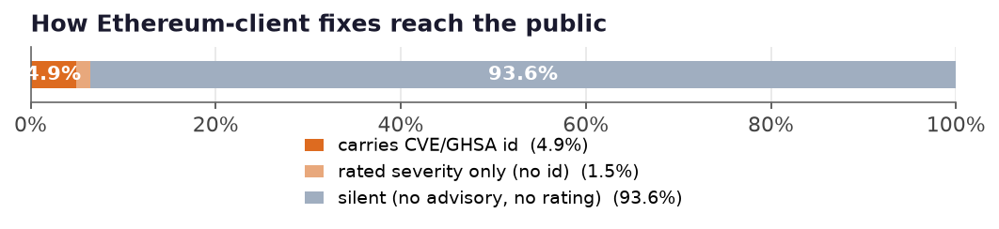
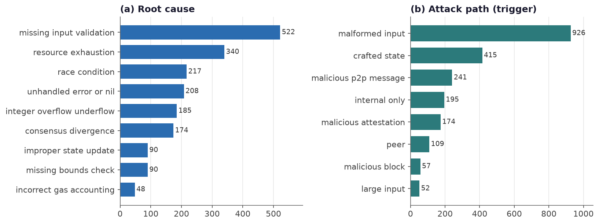
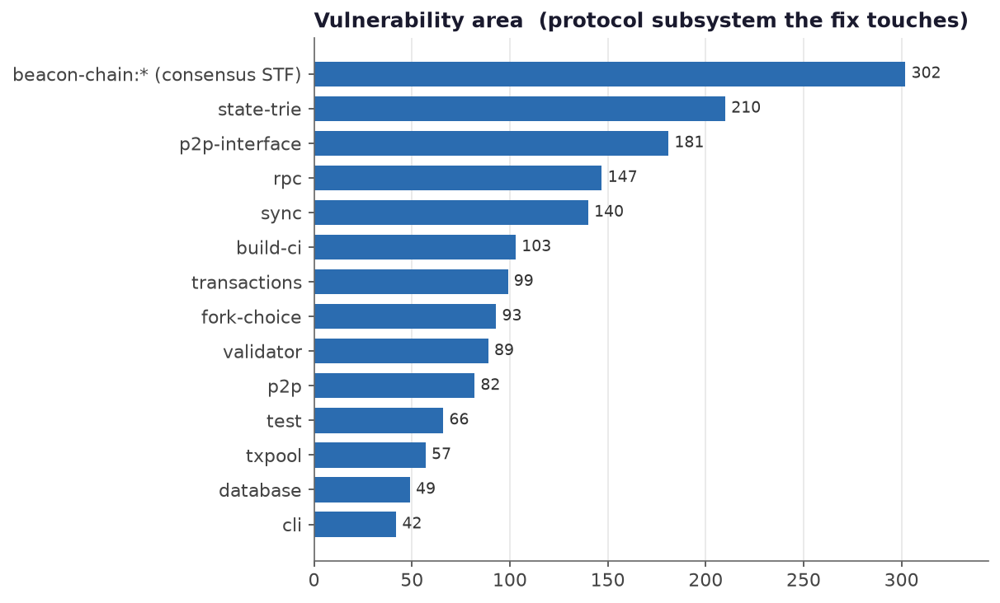
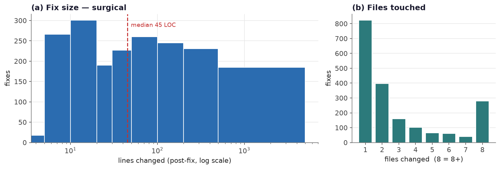
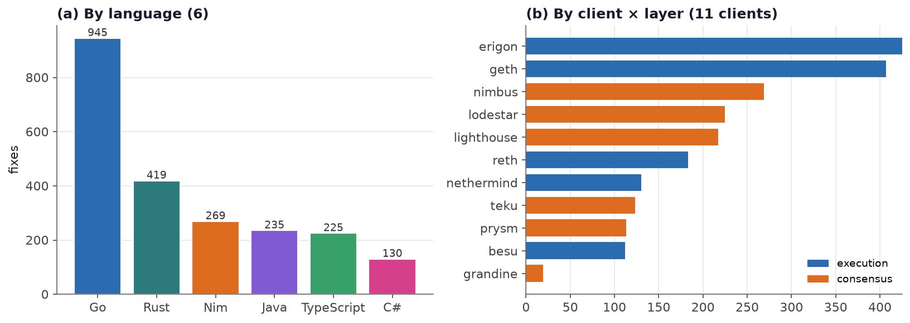
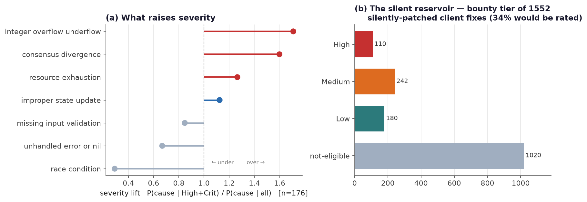
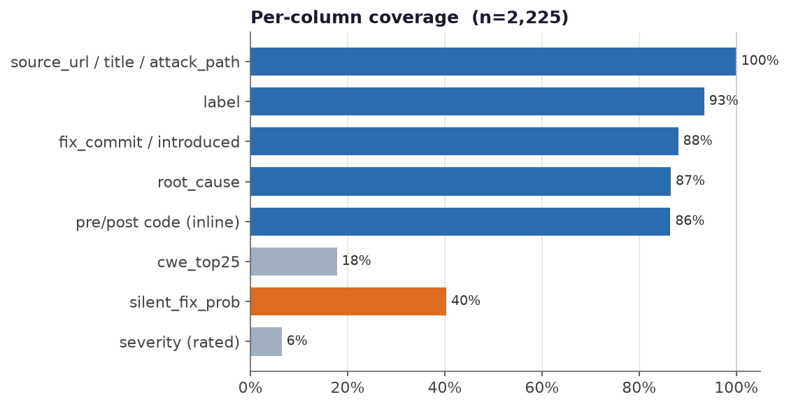

# A quantitative analysis of the ethereum-vuln-dataset

*Read as a short technical report. Every figure is regenerated from
`data/ethereum_vulns.parquet` by `scripts/make_figures.py`; n = 2,225 curated
security fixes across the eleven production Ethereum clients.*

> **Summary.** The corpus is dominated by *silently patched* fixes (≈94% ship
> with no advisory), its vulnerability profile is **availability- and
> consensus-centric** rather than the memory-corruption profile of generic C/C++
> datasets, its fixes are **localized** (43% single-file), its **severe classes are the ones most often patched silently**, and it spans **six
> languages implementing one protocol** — a diversity axis absent from prior
> vulnerability datasets. We interpret each finding against the
> vulnerability-dataset literature (CVEfixes, BigVul, Devign, CrossVul,
> DiverseVul, PrimeVul, and Croft et al.'s data-quality framework).

## 1. Data and method

Each row is one historical vulnerability fix — a merged PR, commit, advisory, or
CVE — from a client's own public repository, normalized to one schema, tiered by
evidence strength (`authority_tier`), and labelled with a protocol `area`,
`root_cause`, `attack_path`, and inline pre-/post-fix code. Distributions below
are computed directly over the curated table; fix-size uses the inlined
post-fix hunks. Method and coverage caveats are in
[`limitations.md`](./limitations.md).

## 2. Finding 1 — the silent-fix majority

**Only 4.9% of curated fixes carry a CVE/GHSA identifier and 6.4% carry any
rated severity; ≈93.6% are silent** — no advisory, frequently an uninformative
commit message. This quantifies, for Ethereum clients specifically, the
silent-patching behaviour that VulFixMiner [Zhou et al., ASE'21] and Sawadogo et
al. describe qualitatively.

*Implication.* CVE-anchored datasets — **CVEfixes** [Bhandari et al., 2021] and
**BigVul** [Fan et al., 2020] — begin from an advisory and walk to the patch, so
by construction they can only observe the ~5% advisory-linked slice. This corpus
is built in the opposite direction (mine the silent majority, then corroborate),
making it **complementary to, not a subset of**, CVE-anchored resources. A model
trained solely on CVE-linked fixes never sees the 94% of Ethereum-client fixes
that never received a CVE.

## 3. Finding 2 — an availability-first, protocol-specific threat profile

Root causes are led by **missing input validation (522)**, **resource exhaustion
(340)**, **race conditions (217)**, **unhandled error/nil (208)**, **integer
overflow (185)**, and **consensus divergence (174)**; triggers are led by
**malformed input (926)**, **crafted state (415)**, and **malicious p2p /
attestation messages**. The modal defect is *"untrusted network input crashes or
diverges a node"* — an **availability / consensus** class.

*Implication.* This is a different distribution from the memory-corruption and
injection classes (CWE-119/787/476/89) that dominate C/C++ corpora such as
**Devign** [Zhou et al., 2019] and **BigVul**. Two of the highest-severity
classes here — `consensus_divergence` (chain split / invalid-block acceptance)
and DoS-via-p2p — are effectively **absent from generic datasets**. A detector
trained on generic CWE data would be structurally blind to the class that matters
most for a blockchain client. This is direct evidence for the domain-shift
concern raised by **CrossVul** [Nikitopoulos et al., 2021] and **DiverseVul**
[Chen et al., 2023]: cross-domain transfer degrades when the vulnerability
distribution differs.

## 4. Finding 3 — where the bugs live

Fixes concentrate in **state/trie**, **p2p networking**, **RPC**, **sync**, and
the consensus **state-transition** (`beacon-chain:*`, esp. attestation and
fork-choice). The `label` vocabulary is grounded in the upstream spec repos'
section names, so it is **language-agnostic**: the same subsystem label applies
whether the fix landed in Rust (Lighthouse) or Go (Prysm).

*Implication.* Attack surface is dominated by the components that parse
**untrusted, adversary-controlled data** — the network stack (p2p, RPC, sync) and
the consensus objects (attestations, blocks). This aligns the empirical bug
distribution with the threat model and gives auditors a prioritization signal
that a flat CWE list does not.

## 5. Finding 4 — fixes are localized

**43% of fixes touch a single file and the median fix changes 45 lines**, though
a long tail of refactor-bundled fixes pulls the mean to ~300 LOC. Localized
security patches are exactly the prior that VulFixMiner and **GraphSPD** [Wang et
al., S&P'23] exploit.

*Implication for the intended use-case.* The corpus is built to answer *"given
the pre-fix code state, would a tool have caught this?"* A tightly-scoped diff,
paired with `introduced_in_commit` (the parent commit = last vulnerable state),
gives a **clean counterfactual boundary** for that evaluation — the localization
is what makes the pre-/post-fix framing tractable.

## 6. Finding 5 — one protocol, eleven implementations, six languages

The corpus spans **Go, Rust, Nim, Java, TypeScript, and C#** across 11 clients
and both layers (execution 1,259 / consensus 966). Crucially, all clients
implement the **same** consensus/execution specification.

*Implication.* Most vulnerability datasets are single-language (predominantly
C/C++) and either single-project or project-agnostic. Here, because the
specification is fixed and the implementations differ, the **same logical
vulnerability can recur across languages**, joined by the `label` area. This
enables studies that generic datasets cannot support — cross-implementation
recurrence, language-specific bug-proneness under an identical spec, and transfer
across implementations. It is the diversity dimension DiverseVul and CrossVul
argue reduces overfitting, obtained here **within a single well-specified
domain**.

## 7. A security-researcher reading — what raises severity

Severity here is the **Ethereum Foundation bug-bounty** grade (network-scale
impact × single-packet/tx reachability), not CVSS. Only **6.4%** of rows were
graded by the bounty, so we estimate the rest with an LLM decomposition
(`impact_type` / `reachability` / `blast_radius`) calibrated against the graded
rows (~60% exact / ~80% within ±1 tier on real severe bugs; method:
[`severity_labeling.md`](./severity_labeling.md)). Combining graded + estimated
tiers, **675 rows (30%) now carry a bounty tier** (176 High/Critical), enough for
a robust reading.

**(a) Reachability × blast-radius is the severity driver** (Fig, left; n=176).
Three root causes are *over-represented* in High/Critical: **integer_overflow
(lift ×1.71)**, **consensus_divergence (×1.60)**, and **resource_exhaustion / DoS
(×1.26)** — precisely the classes that map to the bounty's impact categories
(invalid-ETH / chain split / network takedown). Conversely **`race_condition` has
lift ≈ 0.29** and `unhandled_error/nil` ≈ 0.67: common bugs, but locally-triggered
and low-blast-radius, so out of the "single-packet/tx, network-scale" severity
model by definition. Severity tracks *what the bounty pays for*, not code-bug
class alone.

**(b) The silent reservoir — most severe fixes were never graded** (Fig, right).
Of the **1,552 silently-patched client fixes, ~34% (532) carry a bounty-relevant
tier when assessed** — **110 High, 242 Medium, 180 Low** — and the estimated-High
ones are dominated by `liveness_dos` (89) and `chain_split` (21). Only 60 fixes
in the whole corpus were actually bounty-graded, so the public severity record
**understates the severe population by roughly an order of magnitude**; the
`severity_estimated` / `severity_source` columns expose the would-be-rated slice
explicitly (never overwriting the 60 ground-truth grades).

**Reporting bias, not a severity map.** Among the *graded* rows, Geth dominates —
not because Geth is buggier, but because it publishes GitHub Security Advisories
while most clients patch silently. The graded slice measures **disclosure policy,
not security posture**. And fix size does **not** separate severity (median ~51
LOC high vs 45 overall) — you cannot spot a critical bug by diff size.

*Takeaways for a researcher.* (i) Prioritize by **attacker-reachability ×
subsystem** (p2p, rpc, crypto, consensus state-transition) rather than by whether
a CVE exists. (ii) The **unrated `consensus_divergence` / `resource_exhaustion`
rows are a hunting ground** for under-triaged severe bugs — the corpus surfaces
exactly the silent, high-impact fixes that CVE-anchored datasets miss. (iii)
Because one spec is implemented eleven ways, a severe fix in one client is a lead
to look for its **silent analogue in the others** (§6).

## 8. Data quality and coverage

Assessed along **Croft et al.**'s [2023] data-quality dimensions:

- **Accuracy.** Labels come from spec-grounded rules plus an LLM classifier
  validated at ~0.90 precision; they are *not* human-verified. The
  `authority_tier` / `n_signals` columns expose the accuracy/coverage trade-off
  explicitly, rather than hiding it in a single noisy label — the direction
  **PrimeVul** [Ding et al., 2024] advocates after demonstrating substantial
  label noise in BigVul/Devign.
- **Uniqueness.** De-duplicated by `fix_commit` within a client (108 rows
  removed); only two commits are shared across clients (fork-inherited).
  Duplication is the leading metric-inflation risk flagged by PrimeVul and Croft
  et al.; it is handled.
- **Consistency.** One schema over 11 heterogeneous sources (advisory / stealth
  PR / commit / release / CVE / OSV / RustSec).
- **Currentness.** Freshly crawled (2026), including the newest forks
  (deneb→fulu/gloas, cancun→osaka), where public datasets typically lag years.

The low bars — `severity` (6.4%) and `silent_fix_prob` (40%) — are structural,
not defects: unrated severity *is* the silent-fix signal (§2), and full-commit
LLM classification was deliberately bounded (§8).

## 9. Implications for use

1. **Selection under a <1% base rate.** Security fixes are a fraction of a
   percent of commits — VulFixMiner's "needle in a haystack." The pipeline
   answers with a cheap high-recall pre-filter → gate → LLM cascade rather than a
   blind full-commit scan (measured at ~18 h with precision collapse). Treat
   `authority_tier` as a tunable operating point, not a fixed threshold.
2. **This is a corpus, not a benchmark.** PrimeVul's central lesson is that naive
   splits leak: near-duplicate and temporally-entangled samples inflate reported
   performance. No train/test split is shipped. A consumer **must** add a
   temporal and/or by-client split — and treat fork-shared commits and recurring
   cross-implementation fixes as leakage risks — to obtain an honest
   generalization estimate.

## References

- Bhandari, Naseer, Moonen. *CVEfixes*. PROMISE 2021.
- Fan, Li, Wang, Nguyen. *A C/C++ Code Vulnerability Dataset (BigVul)*. MSR 2020.
- Zhou, Liu, Siow, Du, Liu. *Devign*. NeurIPS 2019.
- Nikitopoulos et al. *CrossVul*. ESEC/FSE 2021.
- Chen et al. *DiverseVul*. RAID 2023.
- Ding et al. *PrimeVul / Vulnerability Detection with Code LMs*. 2024.
- Croft, Babar, Kholoosi. *Data Quality for ML-based Vulnerability Detection*. ICSE 2023.
- Zhou et al. *VulFixMiner*. ASE 2021.  ·  Wang et al. *GraphSPD*. IEEE S&P 2023.
