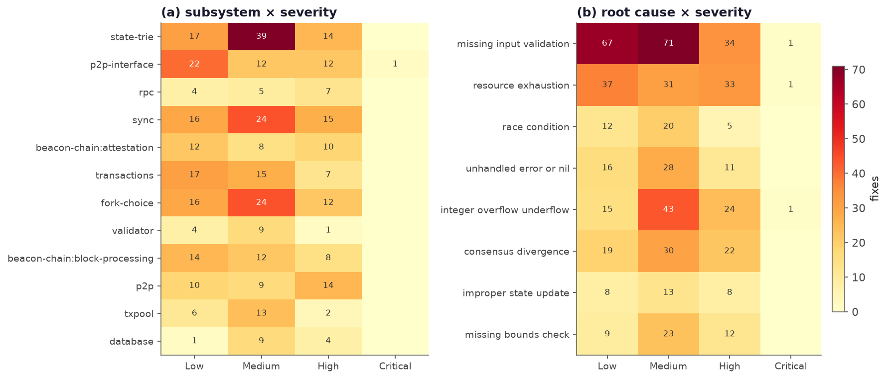

# Ethereum client security checklist & test plan

A working checklist for auditing or hardening an Ethereum client, built by reading
the actual fixes in this corpus and keeping the ones that recur. Items are ordered
by impact: the consensus and value core first (a bug there splits the chain or
moves ETH), then the availability surface (a bug there drops the node). Each item
names a real fix that motivates it and how to test it.

Use it two ways: as a review checklist against an implementation, and as a test
matrix — the *unit* column is what to fuzz or property-test in isolation, the
*e2e* column is what to exercise on a multi-client devnet.

The heatmap is the quick orientation: `missing_input_validation`,
`resource_exhaustion`, `integer_overflow`, and `consensus_divergence` carry the
most High-severity fixes, and they land hardest in the state trie, p2p, sync,
fork-choice, and the beacon-chain state transition.

---

## Tier 1 — Consensus & value core

A wrong result here is a chain split or forged value. Read this code line by line.

### EVM, opcodes & precompiles

- [ ] **Every opcode handles boundary operands** (zero, max, oversized shift) with
  the spec's result and no native exception. *(besu: SHL/SHR/SAR native exception
  at key values; geth: RETURNDATA corruption via `datacopy`)*
- [ ] **Gas accounting matches the spec exactly**, with no signed/unsigned or
  overflow slip. *(besu: Gas allocation error in CALL — Critical; geth: DoS via
  `MulMod`)*
- [ ] **Return-data and memory buffers are bounds-checked before any copy.**
  *(geth: RETURNDATA corruption via `datacopy`)*
- [ ] **Precompiles copy, not alias, their inputs/outputs.** *(geth: shallow copy
  in the 0x4 precompile)*

  | | test |
  |---|---|
  | **unit** | differential opcode/precompile tests vs the reference spec (EELS) over boundary operands; property-test gas math for overflow; fuzz each opcode's stack inputs |
  | **e2e** | official state tests + blockchain tests; execute a block of adversarial opcodes across all clients on a devnet and compare state roots |

### State-transition arithmetic (gas, balance, stake, slots)

- [ ] **All balance / gas / stake / slot arithmetic is overflow- and
  underflow-checked**, including empty-collection edge cases. *(lighthouse: Eth1
  data underflow; underflow in `verify_transfer`; underflow in shuffle with an
  empty list)*

  | | test |
  |---|---|
  | **unit** | property/fuzz tests asserting no under/overflow on extreme and empty inputs |
  | **e2e** | process adversarial blocks and states on a devnet; assert no panic and cross-client agreement |

### Fork-choice

- [ ] **Graph traversals are bounded** — no O(n²) `find_head`, no unbounded
  recursion or stack growth. *(lighthouse: O(n²) `find_head` and stack overflow in
  `filter_block_tree`)*
- [ ] **Zero/null block hashes and missing parents are handled, not assumed.**
  *(lighthouse: avoid 0x00 block hashes in `forkchoiceUpdated`)*
- [ ] **Message timing cannot bias the head** (proposer boost, late/early
  attestations). *(lighthouse: fork-choice timing attack)*

  | | test |
  |---|---|
  | **unit** | fork-choice tests with crafted block trees, equivocations, zero hashes, deep chains |
  | **e2e** | devnet reorg scenarios; proposer-boost edge cases; delayed and duplicated messages |

### State trie & snapshots

- [ ] **Trie/snapshot code returns errors instead of panicking** on malformed or
  short nodes. *(geth: stacktrie explicit errors instead of panic; snapshot unlock
  before return/panic)*
- [ ] **Concurrent access to layers/snapshots is race-free.** *(geth: race
  condition on `diffLayer`)*

  | | test |
  |---|---|
  | **unit** | feed malformed/truncated trie nodes; run the race detector over concurrent layer ops |
  | **e2e** | snap-sync from an adversarial peer serving crafted state |

### Crypto & KZG

- [ ] **Curve points, signatures, and proofs are validated** (on-curve, subgroup,
  length) before use, and parsing never panics. *(geth: invalid-curve DoS in
  secp256k1)*
- [ ] **No `expect`/`unwrap`/assert on attacker-supplied crypto input.**
  *(lighthouse: remove `expect` in `kzg_utils`)*

  | | test |
  |---|---|
  | **unit** | fuzz signature/point/proof parsers with invalid and boundary inputs |
  | **e2e** | gossip invalid BLS signatures and KZG proofs on a devnet; the node must reject them, not crash |

---

## Tier 2 — Availability surface

A bug here is a remote denial of service. Audit for bounds on anything a peer can
control.

### p2p & discovery

- [ ] **Every length/count field from a peer is bounded** before allocation or
  iteration. *(pattern P1: LES `GetProofsV2` DoS; malicious snap/1 request)*
- [ ] **Decode paths never panic** on malformed messages. *(geth: p2p/discover
  crash in `Resolve`; les panic)*

  | | test |
  |---|---|
  | **unit** | fuzz every wire-message decoder; assert allocation stays bounded relative to declared sizes |
  | **e2e** | flood a node with malformed and oversized gossip/request messages; memory and CPU must stay bounded |

### Sync

- [ ] **Downloader concurrency is correct** — no nil, mutex, or timeout-
  resurrection panics under failure. *(geth: timeout resurrection panic; mutex
  regression panics; nil panic from wrong variable)*

  | | test |
  |---|---|
  | **unit** | race detector plus fault injection on the downloader queue |
  | **e2e** | sync against a peer that stalls, reorders, or withholds responses |

### RPC

- [ ] **Request parameters are validated and result sizes are bounded** — no
  unbounded proof or range queries. *(reth: trie-proof edge cases; LES
  `GetProofsV2` DoS)*

  | | test |
  |---|---|
  | **unit** | fuzz RPC param decoding; assert response-size limits |
  | **e2e** | hammer the RPC with expensive/oversized queries; rate and size limits must hold |

### Transaction pool

- [ ] **Malformed and edge-case transactions are rejected without panic** (bad
  signature length, bad sender). *(geth: panic on invalid signature length; panic
  on bad tx sender; nil statedb panic in `applyTransaction`)*

  | | test |
  |---|---|
  | **unit** | fuzz tx decoding and validation |
  | **e2e** | submit adversarial transaction streams; the pool must stay healthy |

### Beacon-chain queues (attestation / block / slasher)

- [ ] **Per-peer queues are memory-bounded** and cannot be grown without limit.
  *(lighthouse: reprocess-queue memory leak; slasher OOM)*

  | | test |
  |---|---|
  | **unit** | queue-bound tests under flood |
  | **e2e** | gossip flood of attestations and blocks; memory must stay bounded |

---

## The highest-value tests: cross-client conformance

The bugs unique to this ecosystem live *between* implementations, so the tests
that find them run more than one client at once.

- [ ] **Differential testing.** Feed identical EVM, SSZ, and epoch-processing
  inputs to every client and diff the output. Any disagreement is a candidate
  chain split.
- [ ] **Adversarial devnet.** Run a mixed-client network with one malicious peer
  driving the P1–P6 patterns: malformed gossip, oversized requests, equivocations,
  crafted reorgs, boundary-value transactions. Assert liveness, bounded resources,
  and a single canonical head.
- [ ] **Spec-divergence fuzzing.** Mutate consensus-critical inputs (opcode
  operands, precompile inputs, SSZ containers) and cross-check every client against
  the reference spec.

---

*Sources: every checklist item traces to one or more fixes in
`data/ethereum_vulns.parquet` (filter by `label` and `root_cause`); the patterns
P1–P6 and the priority map are in [`security_report.md`](./security_report.md).*
