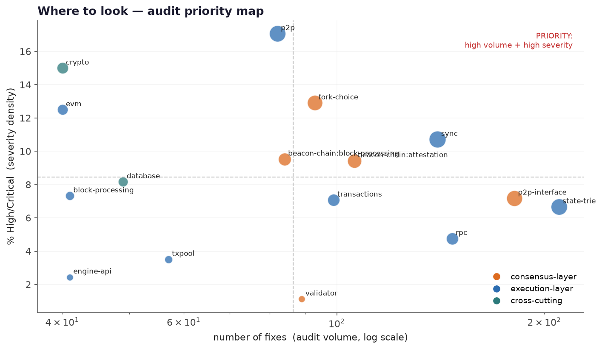

# Auditing Ethereum clients: where the bugs actually live

*A field guide for client developers, audit firms, and white-hat researchers.
Built by reading 2,225 real security fixes from all eleven production Ethereum
clients — six languages, both layers. Every claim traces to
`data/ethereum_vulns.parquet`; the figures rebuild with `scripts/make_figures.py`.*

Open a client's CVE history and you find almost nothing. Fewer than one fix in
twenty ever gets an advisory. The rest ship quietly, inside ordinary-looking
commits, because announcing a live consensus bug before the network upgrades is
itself an attack.

So the CVE list is not the map. The fix history is. We reconstructed it across
Geth, Nethermind, Besu, Erigon, Reth, Lighthouse, Lodestar, Nimbus, Prysm, Teku,
and Grandine, and this guide is what those 2,225 fixes show: where these clients
break, what the breaks look like, and how one client's fix becomes a lead on the
next client's live bug.

## What counts as severe

The Ethereum Foundation bug bounty pays for network-scale impact, and it sets the
bar high. A finding is Critical or High when a single packet or transaction can
split the chain, halt the network, forge or steal ETH, or slash a large share of
validators. Rank your own findings the same way: by the damage one message could
do, not by whether a scanner flags the line.

That framing tells you, before you read a single diff, which bug leads to which
outcome:

| If you find… | in… | the impact is |
|---|---|---|
| a semantic disagreement between clients | EVM opcodes, precompiles, gas accounting, fork-choice, the beacon-chain state transition | **chain split** |
| an arithmetic slip | gas and balance math, precompiles, the state trie | **invalid state or forged value** |
| unbounded work from a peer | p2p, RPC, sync, crypto | **the node goes down** |
| a validation gap on an attestation | the beacon-chain state transition | **validator slashing** |

## Where to look

Two things decide where an audit pays off: where the bugs have historically been,
and how bad a bug in that code can get.

Volume points you at the busy code first. Most fixes land in the state trie,
p2p, RPC, sync, attestation handling, transactions, and fork-choice. That is
where to sweep broadly.

Impact splits those regions in two, and the split is what matters.

The **consensus and value core** is where a single wrong result splits the chain
or mints ETH that should not exist: the EVM and its precompiles, gas and balance
arithmetic, fork-choice, the beacon-chain state transition, the state trie, and
the crypto and KZG code. The `crypto` and `evm` areas see only about forty fixes
each, but every one of them is severe. Read that code line by line.

The **availability surface** is where a crafted message exhausts memory or CPU and
drops the node: p2p, sync, RPC, the txpool, the database. Audit it for missing
bounds on anything an attacker controls.

The dominant failure and its trigger, per subsystem:

| Subsystem | fixes | most common failure ← trigger |
|---|---:|---|
| state-trie | 210 | improper state update ← malformed input |
| p2p-interface | 181 | missing input validation ← malformed input |
| rpc | 147 | resource exhaustion ← malformed input |
| sync | 140 | resource exhaustion ← malformed input |
| beacon-chain:attestation | 106 | missing input validation ← malicious attestation |
| fork-choice | 93 | missing input validation ← crafted state |
| beacon-chain:block-processing | 84 | consensus divergence ← malformed input |
| p2p | 82 | resource exhaustion ← malicious p2p message |
| evm | 40 | integer overflow ← crafted state |
| crypto | 40 | missing input validation ← malformed input |

## How the attacker reaches the code

Every severe bug starts at an untrusted input, and there are only four doors.
In rough order of exposure: the p2p and gossip layer (blocks, attestations, peer
messages), the decoders that parse RLP, SSZ, and JSON before anything validates
them, transactions and the EVM, and chain state crafted during snap-sync. Trace
taint inward from these doors and you retrace the path the reported bugs took.

## The six patterns that keep coming back

Most of the corpus reduces to six shapes. Learn to recognize them and you can
grep for the seventh.

- **P1 — Unbounded work from a peer-controlled count.** A size or count field off
  the wire drives allocation or a loop with no ceiling, and the node runs out of
  memory. *340 fixes.* Seen in *"LES Server DoS via GetProofsV2"* and *"DoS via
  malicious snap/1 request"*. Grep for a length from a request used before it is
  bounded.
- **P2 — A decoder that indexes before it validates.** RLP, SSZ, and JSON parsers
  that slice or index untrusted bytes and panic on the ones that do not fit. This
  is the single largest class, *522 fixes*, e.g. besu's *"SHL/SHR/SAR trigger a
  native exception at key values"*. Grep for a slice or index on decoded input
  with no length check ahead of it.
- **P3 — Arithmetic that overflows in the consensus path.** Gas, balances, slots,
  lengths. *185 fixes*, including geth's *"DoS via `MulMod`"* and besu's Critical
  *"Gas allocation error in CALL"*. Grep for unchecked `+ - *` on 32- or 64-bit
  quantities an attacker can move.
- **P4 — A crash reachable from a decode path.** A nil dereference, an `unwrap`,
  a `panic` sitting downstream of untrusted input. *208 fixes.*
- **P5 — Two clients that disagree on an edge case.** The crown jewel: EVM opcode
  and precompile semantics, gas accounting, a shallow copy of state. *174 fixes*,
  e.g. *RETURNDATA corruption* and the *0x4-precompile shallow copy*. Look wherever
  behaviour on a corner case is not pinned bit-for-bit by the spec.
- **P6 — Fork-choice and reorg handling under crafted timing.** *93 fixes across
  six clients.* Focus on `on_block`, proposer boost, and reorg logic.

## The leverage no other target gives you

Here is what makes Ethereum clients unusually rewarding to audit. Eleven teams
built eleven independent implementations of one specification. When Geth fixes the
way it decodes an attestation, that fix is a checklist item for the other ten
clients. And because fixes ship without an advisory, the others have often not
caught it yet.

The method is simple and repeatable. Take a fix in one client. Find the matching
code in the rest, joined by subsystem. Check whether the same guard is there.
Where it is missing, you may be holding a live bug. The subsystems with fixes in
the most clients are the richest ground: p2p-interface, sync, and fork-choice (six
clients each), the KZG and sync-committee code (six), and crypto (eight).

Its sharpest form is spec-divergence testing. Every client runs the same EVM
opcodes, the same precompiles, the same SSZ encoding, the same epoch processing.
Feed them all one adversarial edge case and watch for a single client to disagree.
One byte of disagreement in the deterministic core is a chain split, and a chain
split is the most valuable bug in the system.

## Three fixes, three lessons

**RETURNDATA corruption** (Geth, `core/vm/instructions.go`, High). A crafted
transaction drove `RETURNDATACOPY` to a state where `RETURNDATA` could be
corrupted. A client that computed a different result would accept a different
state root and fork off the network. This is P5 in the wild.

**A malicious handshake that takes the node down** (Geth,
`crypto/secp256k1/curve.go`, High). One crafted message drove excessive work in
the curve code and dropped the node remotely — the bounty's "bring down the
network with one packet," landing at the seam between crypto and networking.

**A gas-allocation error that breaks value** (Besu, EVM `CALL`, Critical). A
signed-versus-unsigned slip in the available-gas computation passed the wrong gas
into sub-calls. Execution diverged, and value was on the line. Gas arithmetic sits
in the consensus path, which is what turned an off-by-something into a Critical.

## What carries over to any chain

1. **Determinism is a security property.** Two honest nodes must reach the same
   result byte for byte. Every source of non-determinism — an arithmetic edge
   case, an ambiguous serialization, iteration order, floating point, uninitialized
   memory — is a potential chain split. Audit the deterministic core for
   disagreement, not only for crashes.
2. **Untrusted peer input is the main surface.** Parsing before validating,
   trusting a wire-supplied count, and doing unbounded work per peer are the engine
   behind most denial-of-service bugs. Treat every decoder and every length off the
   network as hostile.
3. **Value-path arithmetic must be exact.** Gas, balances, stake and slashing
   weights, and slot math cannot overflow, underflow, or round differently between
   implementations.
4. **A client monoculture is a systemic risk and a research asset at once.** A bug
   shared by clients running more than a third of the network is a network-level
   event. A bug in one client is a lead on the rest. Diversity both softens the
   blast and hands you the next finding.
5. **Rank by impact, not by CVE.** Weigh a finding by what one message could
   actually cause. Most of the bugs here never had a CVE, so a CVE-only view walks
   straight past them.

## The audit, in order

1. Scope by the map. Read `crypto`, the `EVM`, and the consensus state transition
   for critical bugs; sweep `p2p`, `sync`, and `RPC` for denial of service.
2. Start at the doors. From the p2p, RPC, transaction, and attestation decoders,
   follow untrusted fields to allocations (P1), indexing (P2), arithmetic (P3), and
   crash paths (P4).
3. Grep the six smells across the target subsystem.
4. Run variant analysis. Diff the same spec function across clients; a guard
   present in one and missing in another is a candidate.
5. Rank what you find by the damage one packet or transaction could do.

Working from these patterns as concrete, per-subsystem review items and tests?
See the [security checklist & test plan](./checklist.md).

## Caveats and disclosure

Labels are model- and heuristic-derived (about 0.90 precision), not hand-verified.
Severity on unrated rows is estimated, calibrated to roughly 60% exact and 80%
within one tier on known-severe bugs ([`severity_labeling.md`](./severity_labeling.md)).
The corpus is historical, so treat any variant lead as a hypothesis to confirm
against today's code, not a finding. Fuller caveats are in
[`limitations.md`](./limitations.md). Report anything new through the client's own
security process and the [Ethereum bug bounty](https://ethereum.org/en/bug-bounty/).

*Companion reading: [`analysis.md`](./analysis.md) for the dataset-level
statistics, [`limitations.md`](./limitations.md) for the fine print.*
