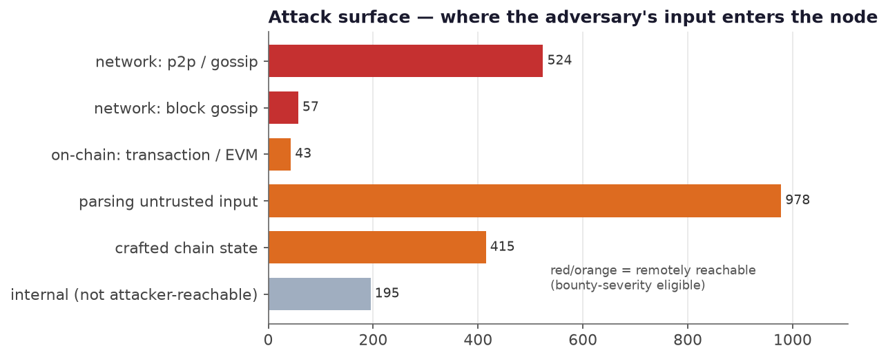

# Silent Wounds: A Field Guide to Vulnerability Fixes Across Eleven Ethereum Clients

*A technical report for security researchers and client auditors. All numbers and
examples are drawn from `data/ethereum_vulns.parquet` (n = 2,225 curated fixes);
figures are regenerated by `scripts/make_figures.py`.*

---

> **Abstract.** We study 2,225 historical security fixes across all eleven
> production Ethereum clients — the exact scope of the Ethereum Foundation bug
> bounty. Read through that bounty's own severity model (impact × remote
> reachability), the data yields a concrete map from *what pays* to *where to
> look*: which bug classes realize a chain split, a node takedown, validator
> slashing, or invalid-ETH creation, and in which subsystems they recur. We find
> that **~94% of fixes shipped silently** (never graded by the bounty); that,
> estimating the bounty tier of those silent fixes, **≈110 would rate *High*** and
> ~420 more Medium/Low — a severe population an order of magnitude larger than the
> 60 that were actually graded; and that because one specification is implemented
> eleven ways, **a fix in one client is a ready-made variant lead for the other
> ten**. We close with a hunting playbook and three case studies with real
> pre-/post-fix code.

## 1. Why this corpus, for a security researcher

Ethereum clients are a high-value, adversarial target: every node parses
untrusted p2p messages, blocks, transactions, and attestations, and any
implementation disagreement can split the chain. Yet the public vulnerability
record is thin — clients **silently patch** most issues (no CVE, vague commit
message) to avoid tipping off attackers before the network upgrades.

This corpus inverts that opacity. It mines the *silent* fixes — merged PRs,
commits, releases — across all eleven clients and labels each with its protocol
**area**, **root cause**, **attack path**, and **inline pre-/post-fix code**. For
a researcher it answers four operational questions: *where is the attack surface,
which bug patterns recur, what has already been fixed in one client but maybe not
another, and what does a real fix look like.*

## 2. The premise: what "severity" means here

Severity in this dataset is **not** CVSS and **not** a code-bug taxonomy. The
rated rows are graded by the **Ethereum Foundation bug bounty**, whose scope is
exactly these clients (+ c-kzg-4844 and the deposit contract) and whose severity
is defined by **network-scale impact reachable by a single packet or on-chain
transaction**:

| Tier | Reward | Representative definition |
|---|---|---|
| **Critical** | up to \$1,000,000 | *create infinite ETH finalized by the network* · *steal/burn ETH from all EOAs* · *take down the entire network with a single malicious on-chain transaction* · *slash >50% of validators* |
| **High** | up to \$50,000 | *cause network splits affecting >33%* · *bring down >33% by a single on-chain transaction* · *slash >33% of validators* |
| **Medium** | up to \$10,000 | *splits >5%* · *bring down >5%* · *slash >1%* |
| **Low** | up to \$2,000 | *splits >0.01%* · *bring down >0.01% by a single packet/tx* |

Two consequences follow, and they frame everything below:

1. **Severity ⇔ (impact magnitude) × (remote reachability).** A bug is only
   graded if an *external* actor can trigger it with a single packet/tx. This is a
   definition, not a correlation — it is why locally-triggered classes (e.g. data
   races) essentially never appear in the rated slice (§5), and why the rated
   population is dominated by consensus and denial-of-service impact.
2. **The bounty only sees what was submitted.** A bug found internally (code
   review, fuzzing) and quietly fixed is never graded — so *the absence of a
   severity is not evidence of low impact.* The 94% silent majority (§7) contains
   the fixes that, had they been reported, the same definition would have rated.

## 3. The attack surface — where the adversary's input enters

The bounty's "single network packet or on-chain transaction" is the taint source.
Mapping every fix's `attack_path` to its entry channel shows the surface a
researcher should prioritize: **p2p / gossip** (malicious messages, attestations,
peers, block gossip), the **untrusted-parsing** layer (RLP/SSZ/JSON decoders that
run before any validation), **on-chain transactions / the EVM**, and **crafted
chain state** (snap-sync, historical data). Only a minority of fixes are
`internal_only` — the rest sit on an attacker-reachable path, which is exactly the
population the bounty grades.

## 4. From payout to code: the severity-realization map

The single most useful artefact for a researcher is the mapping from *bounty
impact category* → *bug class in our taxonomy* → *code area*, grounded in the
actual rated fixes. This says **where a $-critical bug is realized**:

| Bounty impact | Realized by (root cause) | Where it lives | Real rated example |
|---|---|---|---|
| **Chain split / invalid-block acceptance** (High) | `consensus_divergence` | EVM opcodes & precompiles, state-transition, fork-choice | geth **"RETURNDATA corruption via datacopy"** (High); geth **"Consensus flaw during block processing"** (High) |
| **Node / network takedown (DoS)** (High) | `resource_exhaustion` | p2p, rpc, sync, crypto | geth **"DoS via malicious p2p message"** (High); geth **"DoS via `MulMod`"** (High) |
| **Invalid state / value integrity** (up to Critical) | `integer_overflow`, `improper_state_update` | EVM gas & balance arithmetic, precompiles | besu **"Gas allocation error in CALL operations"** (Critical); geth **"Shallow copy in the 0x4 precompile → EVM memory corruption"** (High) |
| **Validator slashing / consensus safety** (High) | `missing_input_validation` in the beacon state-transition | attestation, effective-balance, slashing | lighthouse **"Incorrect processing of effective balances in Electra epoch processing"** (High) |

The empirical severity *lift* (Fig, left) confirms the map: `consensus_divergence`
(×1.55), `resource_exhaustion` (×1.39), and `integer_overflow` (×1.28) are
over-represented among Critical/High, while `race_condition` sits at lift ≈ 0 — a
local race does not "bring down X% of the network with a single packet," so it
falls outside the severity model even when it is a real bug.

## 5. Recurring vulnerability patterns (the anti-patterns to hunt)

Six archetypes account for most of the corpus. Each is a reusable hunting
hypothesis — a mechanism, a trigger, and a code smell.

- **P1 · Unbounded work from an attacker-controlled count → DoS.** A p2p/rpc
  request whose size/count field is trusted drives unbounded allocation or
  iteration. *340 `resource_exhaustion` fixes.* Examples: geth *"LES Server DoS
  via GetProofsV2"*, *"DoS via malicious snap/1 request"*. **Smell:** a length/
  count from the wire used before it is bounded.
- **P2 · Missing length/bounds validation in a decoder → OOB / panic.** RLP, SSZ,
  and JSON decoders that index or slice before validating. *522
  `missing_input_validation` fixes* — the largest class. Example: besu *"SHL, SHR,
  SAR operations trigger native exception at key values"*. **Smell:** slice/index
  on decoded input without a length check.
- **P3 · Integer overflow/underflow in protocol arithmetic.** Gas, balance, slot,
  and length math. *185 fixes.* Examples: geth *"DoS via `MulMod`"*, besu *"Gas
  allocation error in CALL"* (Critical). **Smell:** unchecked `+/-/*` on
  attacker-influenced 32/64-bit quantities in gas/balance code.
- **P4 · Nil / unwrap / unhandled error on malformed input → crash.** *208
  `unhandled_error_or_nil` fixes.* **Smell:** `unwrap()`/nil-deref/`panic` reachable
  from a decode path.
- **P5 · Consensus divergence — implementations disagree on an edge case.** The
  crown-jewel class: EVM opcode/precompile semantics, gas accounting, state copy.
  *174 fixes.* Examples: *RETURNDATA corruption*, *0x4 precompile shallow copy*.
  **Smell:** any place where a client's behaviour on a corner case is not
  bit-for-bit pinned by the spec.
- **P6 · Fork-choice / reorg edge cases.** *93 `fork-choice` fixes across 6
  clients.* **Smell:** `on_block`, proposer-boost, and reorg handling under
  crafted timing/state.

## 6. Cross-client variant analysis — the corpus's superpower

Eleven clients implement **one** specification in **six** languages. The same
logical bug therefore recurs across implementations, and the `label` area +
`root_cause` are the language-agnostic join keys. Subsystems that are buggy in
*many* clients are the strongest variant-hunting grounds:

| Subsystem | # clients with fixes | # fixes |
|---|---:|---:|
| `p2p-interface` | 6 | 181 |
| `sync` | 6 | 140 |
| `fork-choice` | 6 | 93 |
| `crypto` | 8 | 40 |
| `builder` | 6 | 25 |
| `kzg-commitments` | 6 | 18 |
| `beacon-chain:sync-committee` | 6 | 16 |

**Operational use — N-day variant hunting.** Take any fix in client *A* (ideally a
rated one), locate the analogous code in *B…K* by `label`, and check whether the
same guard exists. Because most fixes are silent (§7), a fix that landed in one
client is frequently **not yet** mirrored in the others — a supported, repeatable
path to fresh findings that a single-project or CVE-anchored dataset cannot offer.
This is the domain-diversity axis CrossVul/DiverseVul argue for, obtained *within
one specification*.

## 7. The silent reservoir — where the un-graded severe bugs are

Only **4.9%** of fixes carry a CVE/GHSA id and **6.4%** were graded by the bounty;
**~93.6% shipped silently.** These are not low-value noise but the **un-graded
population** — fixes found by internal review or fuzzing and quietly shipped, which
the bounty never scored.

**We can now size the reservoir.** Estimating the bounty tier of the silently-
patched client fixes (decompose → map → calibrate; [`severity_labeling.md`](./severity_labeling.md))
shows that **~34% (532 of 1,552) would carry a bounty-relevant severity — 110
High, 242 Medium, 180 Low** (Fig 7, right). The estimated-High reservoir is
dominated by `liveness_dos` (89) and `chain_split` (21): **≈110 silently-patched,
never-graded fixes that the bounty's own definition would rate High.** Only 60
fixes in the corpus were actually graded, so the public severity record
**understates the severe population by roughly an order of magnitude** — and the
`severity_estimated` / `severity_source` columns hand a researcher that
would-be-High list directly.

There is also a **reporting bias** worth internalising: Geth accounts for 41% of
all Critical/High rows, not because Geth is buggier but because it *publishes
advisories* while others patch silently. The rated slice measures disclosure
policy, not security posture — so a client's *silence is not safety*, and its
silent fixes are exactly where variant leads accumulate.

## 8. Case studies

**8.1 — Consensus split via `RETURNDATA` corruption (geth, High).**
`core/vm/instructions.go`, `root_cause = consensus_divergence`,
`attack_path = malicious_tx`. A crafted transaction exercised `RETURNDATACOPY`
such that `RETURNDATA` could be corrupted — a client that computed a different
result would accept a different state root and **split from the network**. This is
the P5 archetype: an EVM corner case not pinned identically across clients. Fix
commit and the exact hunks are in `pre_fix_code` / `post_fix_code`.

**8.2 — Node takedown via a malicious p2p message (geth, High).**
`crypto/secp256k1/curve.go` (the ECIES invalid-curve handling),
`root_cause = resource_exhaustion`, `attack_path = malicious_p2p_message`. A
single crafted handshake/message could drive excessive work → a remote node
takedown, i.e. the bounty's "bring down the network by a single packet." Archetype
P1/P3 at the crypto boundary of the network stack.

**8.3 — Value-integrity via a gas-allocation error (besu, Critical).**
EVM `CALL` gas calculation, `root_cause = integer_overflow_underflow`. A signed/
unsigned 32-bit error in available-gas computation passed incorrect gas into
sub-calls — an execution-semantics divergence with value impact, rated **Critical**.
Archetype P3, and a reminder that gas arithmetic is consensus-critical.

## 9. A hunting playbook

1. **Taint from the entry points (Fig, §3).** Start at the p2p/gossip, RPC, tx,
   and attestation decoders; follow untrusted fields to allocations (P1),
   slices/indexing (P2), arithmetic (P3), and nil/unwrap (P4).
2. **Run variant analysis (§6).** For each rated or high-signal fix, diff the
   analogous subsystem in the other clients by `label`; a missing guard is a
   candidate. Prioritise `p2p-interface`, `sync`, `fork-choice`, `crypto`, `kzg`.
3. **Hunt spec-divergence (P5).** Where clients implement the same pyspec/EELS
   function (EVM opcodes, precompiles, SSZ, epoch processing), test edge cases for
   behavioural disagreement — the direct route to chain-split severity.
4. **Prioritise by the realization map (§4).** Weight findings by the impact they
   could realize (split / takedown / value / slashing), i.e. by what the bounty
   pays, not by whether a CVE exists.
5. **Mine the silent reservoir (§7).** The un-graded `consensus_divergence` and
   `resource_exhaustion` fixes are both a study set of real severe bugs and a
   source of not-yet-ported variants.

## 10. Limitations & responsible use

Labels are model/heuristic-derived (~0.90 precision), not human-verified; severity
is sparse *by construction* (§2); recall is bounded to trace-leaving fixes; and the
corpus is historical — a "variant lead" must be verified against current code
before it is a finding. Full caveats: [`limitations.md`](./limitations.md). Use
for defense, auditing, and detector training; coordinate any *new* finding through
the relevant client's security process and the [Ethereum bug bounty](https://ethereum.org/en/bug-bounty/).

## References

Ethereum Foundation Bug Bounty Program (severity model & scope). · Zhou et al.,
*VulFixMiner*, ASE 2021. · Wang et al., *GraphSPD*, IEEE S&P 2023. · Bhandari et
al., *CVEfixes*, 2021. · Fan et al., *BigVul*, MSR 2020. · Nikitopoulos et al.,
*CrossVul*, 2021. · Chen et al., *DiverseVul*, RAID 2023. · Ding et al.,
*PrimeVul*, 2024. · Croft et al., *Data Quality for Vulnerability Detection*, ICSE 2023.

*Companion: [`analysis.md`](./analysis.md) (dataset-level statistics) ·
[`limitations.md`](./limitations.md) · [`silent_fix_detection.md`](./silent_fix_detection.md).*
