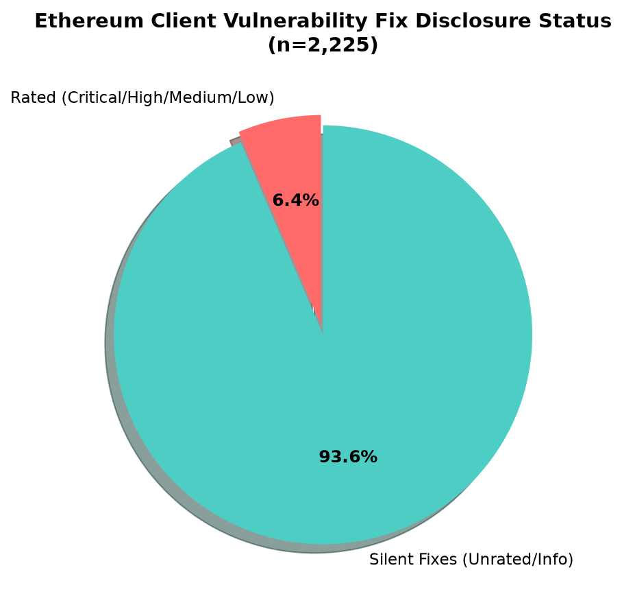
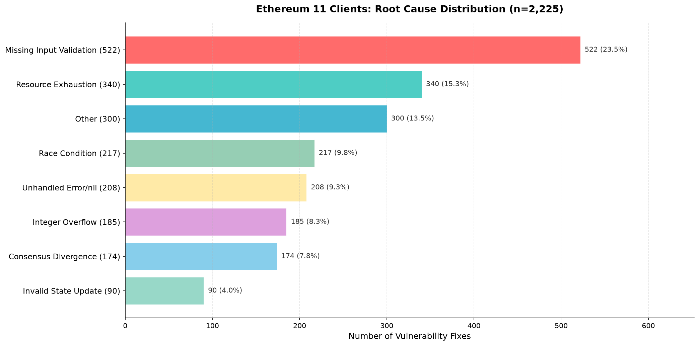
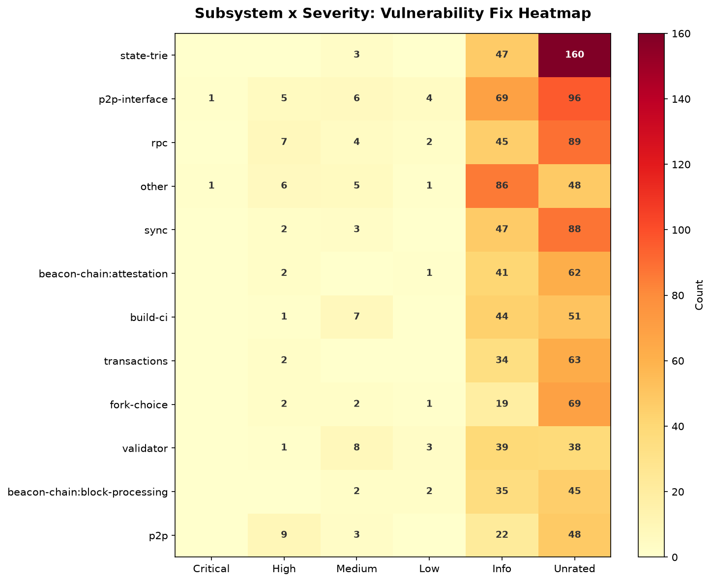

# Ethereum Client Security: A Field Guide from 2,225 Fixes

> **For L1/L2 core developers, auditors, and security researchers** — what 2,225 security fixes across 11 clients actually tell us about where bugs hide and how to find them

---

## TL;DR

- **11 clients, 6 languages, 2,225 security fixes.** Of these, **93.6% carry no formal severity rating** (Critical/High/Medium/Low). They are "silent fixes" — patches committed under labels like "refactor" or "fix edge case" without advisories or CVEs.
- **Six bug patterns account for ~75% of all fixes.** Input validation failures, resource exhaustion, race conditions, unhandled errors, integer overflows, and consensus divergences.
- **Because Ethereum is implemented 11 ways from one spec, a fix in one client is a lead for unreported bugs in the others.** Cross-client differential analysis is the highest-ROI hunting strategy.

---

## 1. The Map Is Not the CVE List

Open your client's CVE history. Geth, Nethermind, Besu, Erigon, Reth. Lighthouse, Lodestar, Nimbus, Prysm, Teku, Grandine. These eleven clients secure hundreds of billions in assets.

The CVE count? **A few dozen.**

If you stop there, you conclude Ethereum clients are remarkably secure. **That conclusion is wrong.**

We crawled the full commit history of all 11 clients and identified **2,225 security fixes**. Of these, **93.6% have no formal severity rating** — no Critical, no High, no Medium, no Low. They live in raw commits labeled "refactor state transition" or "fix edge case in block processing."

The reason is simple. Disclosing a live consensus bug is itself an attack. You cannot announce "here is how to fork the chain" before the majority of the network has upgraded.

**So the CVE list is not the map. The commit history is.**



[NyxFoundation/ethereum-vuln-dataset](https://github.com/NyxFoundation/ethereum-vuln-dataset) is the corpus that builds this map. It normalizes past security fixes from 11 clients into a single schema, labeling protocol area, root cause, attack path, and before/after code. This article is a field guide based on that data and the analysis in `docs/`.

---

## 2. What Actually Happened: Chain Splits and DoS in Production

The dataset only captures fixes that left traces. Even so, the content is stark.

### Besu: CALL/DELEGATECALL Gas Miscalculation (Critical)

A signed/unsigned 32-bit type conversion error in `CALL` and `DELEGATECALL` gas calculation caused Besu to compute a different `stateRoot` at the boundary where gas passthrough affects inner-call success — **a potential chain split** (`GHSA-4456-w38r-m53x`, CVE-2022-36025). Found by differential fuzzing (goevmlab); no confirmed mainnet exploitation. On a single-client network, an attacker could have intentionally overdrawn gas.

### Geth: Ethereum Packet of Death (LES Protocol, High)

The `GetBlockHeadersMsg` handler misconverted the `Skip` field. A single packet with `query.Skip = -1` caused an out-of-bounds array access and **instant node crash** (geth < 1.8.11). A related `count=0` integer underflow (`count-1` causing memory exhaustion) shares the same root cause. These are not "just DoS" — they are network-segmentation weapons.

### Geth: RETURNDATA Corruption (High)

A memory management bug in EVM interpreter return-data handling computed a wrong `stateRoot` for a specific transaction, causing a **minority chain split on mainnet at block 13107518** on August 22, 2021 (`GHSA-9856-9gg9-qcmq`). A single contract call combination broke network consensus.

### Lighthouse: LMDB Cursor Reuse Memory Corruption (fork-choice, slasher)

The LMDB backend returned a reference to its internal cursor buffer without copying. When the caller later deleted the cursor entry, LMDB could overwrite memory still held by the caller. It lay dormant for a long time until a later refactor made that code path reachable (`PR#6211`). **No one noticed for years.**

Most of these were recorded only as Unrated or Info. Your CVE scanner missed them.

---

## 3. Six Patterns Account for 75% of All Fixes

Aggregating 2,225 fixes by root cause reveals that vulnerabilities cluster into six patterns. These are "the six smells of Ethereum clients" — literal grep targets for your next audit.

| Pattern | Root Cause | Count | Share |
|---|---|---:|---:|
| **P1** | `missing_input_validation` | 522 | 23.5% |
| **P2** | `resource_exhaustion` | 340 | 15.3% |
| **P3** | `race_condition` | 217 | 9.8% |
| **P4** | `unhandled_error_or_nil` | 208 | 9.3% |
| **P5** | `integer_overflow_underflow` | 185 | 8.3% |
| **P6** | `consensus_divergence` | 174 | 7.8% |

**These six patterns cover ~75% of all fixes.**



*These patterns map to the attack-path classification (P1-P6) in [`docs/security_report.md`](https://github.com/NyxFoundation/ethereum-vuln-dataset/blob/main/docs/security_report.md). Detailed attack-path mappings and grep strategies are in that document.*

**P1 — Missing Input Validation (522):**
Peer-supplied `count`, `length`, `offset`, `index` used without validation. Geth's `count=0` integer underflow is canonical. Treat every peer-input decode site as hostile.

**P2 — Resource Exhaustion (340):**
Can peer-supplied size/count consume unbounded memory/CPU/disk? Reth's unbounded libp2p streams and Lighthouse's reprocess-queue memory leak are examples. Grep for `make([]byte, peerSuppliedSize)`.

**P3 — Race Condition (217):**
Is shared state between goroutines/threads locked? Variables captured in `go func`, shared maps without `sync.Mutex`.

**P4 — Unhandled Error/Nil (208):**
Prominent in Go clients. Missing error checks panic. Grep for `if err != nil { _ = err }` and assignments to `_`.

**P5 — Integer Overflow (185):**
Gas calculations, balance arithmetic. Range checks before `+`/`-`/`*`. Besu's SHL/SHR/SAR native exceptions and Geth's `MulMod` DoS are canonical.

**P6 — Consensus Divergence (174):**
The most severe. EVM opcodes, precompiles, gas calculation, fork-choice, beacon-state transitions — any cross-client output difference on identical input is a chain-split.

### Example: Geth `dataCopy` Precompile (0x04) Shallow Copy

Geth's `0x00...04` precompile shallow-copied its input (`GHSA-69v6-xc2j-r2jf`). An attacker wrote value `X` to memory region `R`, invoked `0x04`, then overwrote `R` with `Y` and executed `RETURNDATACOPY`. Geth pushed `Y` onto the stack instead of `X`, computing a different `stateRoot` from other clients. **One client's minor implementation difference threatened network consensus.** This patch is an immediate alarm to re-verify the same precompile in every other client.

---

## 4. Cross-Client Variant Analysis: One Fix Is a Lead for Ten Bugs



The most powerful use of this dataset is converting one client's fix into audit leads for another.

Ethereum's unique feature: **one spec, six languages, eleven implementations.**

> If Geth finds a boundary-value bug in `SHL/SHR/SAR`, **other clients implementing the same spec likely harbor similar bugs.**

This is not theoretical. Geth's shallow-copy bug in the `dataCopy` precompile (`GHSA-69v6-xc2j-r2jf`) means checking the same precompile in other clients immediately surfaces potential chain-split risk.

**Practical workflow:**

1. Load `data/ethereum_vulns.parquet`
2. Filter by `label` (e.g., `evm`) and `root_cause` (e.g., `integer_overflow_underflow`)
3. Read a fix diff from one client — understand **what was patched**
4. Grep the same spec function in the other 10 clients — check if **the same guard exists**
5. No guard → **candidate bug**

**The highest-value test is differential testing.** Feed identical EVM, SSZ, and epoch-processing inputs to all clients and compare outputs. A single byte mismatch in deterministic core logic is a **chain split** — the most valuable bug class in the system.

---

## 5. A Checklist You Can Run Tomorrow

### Phase 1: Scope (5 minutes)

**For chain-split / value-forge bugs:**
`crypto` → `evm` → `fork-choice` → `beacon-chain:block-processing` → `state-trie`

**For DoS / node-crash bugs:**
`p2p-interface` → `sync` → `rpc` → `txpool`

### Phase 2: Block Entry Points (first hour)

Start at every point where untrusted data enters the system: peer inputs, RPC inputs, transactions, attestations.

- Is there validation immediately after decode?
- Is peer-supplied `length`/`count`/`offset` used for memory allocation?
- Are error paths suppressed?

### Phase 3: Grep the Six Smells (half day)

Mechanically check P1-P6 patterns in target subsystems.

### Phase 4: Cross-Client Diff (one day)

Diff the same spec function across all clients. Guard asymmetry is an unreported-bug candidate.

### Phase 5: Rank by Impact (30 minutes)

| Finding | Location | Impact |
|---|---|---|
| Cross-client semantic mismatch | EVM opcodes, precompiles, gas calc, fork-choice | **Chain split** |
| Arithmetic error | Gas/balance calc, precompiles, state trie | **Invalid state or value forgery** |
| Unbounded peer work | p2p, RPC, sync, crypto | **Node crash** |
| Validator trap | Attestation handling, slashing conditions | **Validator slashing** |

---

## 6. Limitations: What This Dataset Is and Is Not

Before using it, understand the boundaries.

- **Only 6.4% have ground-truth `severity`.** The rest is LLM-estimated (`severity_estimated`). Exact match with bounty grading is ~60%, within ±1 tier ~80%. Critical tends to be underestimated. **But `severity_estimated` is accurate enough for filtering.** The 326-row `confidence == "high"` subset is usable without manual verification.
- **Recall is limited to "fixes that left traces."** Truly silent fixes — vague commit message + no advisory + no path clue — are invisible to crawlers. **But the traces that remain contain enough patterns.** 1,808 of 2,225 rows have `authority_tier != "C_candidate"`, an essential slice.
- **`introduced_in_commit` is the fix commit's parent, not the true introduction.** True origin requires `git blame` walking. **But the pre-fix code state already provides enough clues to reproduce attack paths.**
- **This is a corpus, not a benchmark.** No train/test split included. You must add temporal or per-client splits yourself and treat fork-shared commits and cross-implementation duplicates as leak risks. **But for exploration and audit planning, no benchmark is needed.**
- **Label accuracy is ~0.90.** Not hand-verified. Individual rows may be wrong. **But pattern-level reads are stable.** 522 input-validation failures (P1) are statistically significant even with label noise.

**Not perfect data. But a usable map.**

These constraints teach you how to use it. Below is what you can do with this map starting tomorrow.

---

## 7. Next Steps: A 30-Minute Action Plan

| Time | Action | Output |
|---|---|---|
| 0-10 min | Grep P1-P3 from `critical_high_findings.md` against your client | Identify matching code |
| 10-20 min | Run `collection/llm_classify_fixes.py` on your own repo | List historical silent fixes |
| 20-30 min | File security-review tickets for findings | Backlog for next sprint |

### For L1/L2 Core Developers

If your PR review lacks P1-P6 checks, the same type-conversion bug that hit Besu will sail through.

Apply `checklist.md` directly to your security review. P1-P6 greps are worth adding to CI for new PRs. The silent-fix detector (`gemma4:31b`, F1=0.872) can rescan your historical commits.

### For Audit Firms

Skip the 506-row Critical/High corpus and you will repeat the same blind spots as past silent fixes.

This dataset compresses Ethereum client audit pre-investigation from one week to one hour. Add the concrete question "does this client exhibit the same patterns as these 506 Critical/High cases?" to your audit plan. Cite `security_report.md` patterns and `critical_high_findings.md` examples to optimize scope and time allocation.

### For Security Researchers

Leave the F1=0.872 detector idle and someone else finds the next silent fix first.

The silent-fix detector (`collection/llm_classify_fixes.py`) requires no training and applies directly to your target repo. `gemma4:31b` runs free at F1=0.872; Claude Opus is the baseline if you need higher precision. Report findings through responsible disclosure.

### Getting the Dataset

```python
import pandas as pd
df = pd.read_parquet("data/ethereum_vulns.parquet")

# Essential slice (high confidence)
essential = df[df.authority_tier != "C_candidate"]  # 1,808 rows

# Strongest evidence only
high_conf = df[df.confidence == "high"]  # 326 rows

# Ground-truth severity only
rated = df[df.severity_source == "bounty-graded"]  # 60 rows
```

GitHub: [`NyxFoundation/ethereum-vuln-dataset`](https://github.com/NyxFoundation/ethereum-vuln-dataset) (CC-BY-4.0)

---

## Closing

Ethereum security is not measured by CVE count.

Real vulnerabilities are fixed silently — under labels like "refactor state transition," in messages like "fix edge case in block processing," or in a single added line: `if count == 0 { return err }`.

This dataset is the tool that breaks that silence.

The truth from 2,225 fixes is simple: **bugs repeat. patterns read. and one client's fix is a map to another client's unreported bugs.**

**Your client's next silent fix is already in this dataset.**

Close the CVE list. Open the commit history. **The map that was missing is there.**

---

*Data: [NyxFoundation/ethereum-vuln-dataset](https://github.com/NyxFoundation/ethereum-vuln-dataset) (CC-BY-4.0)*  
*Bug Bounty Program: [Ethereum Bug Bounty](https://ethereum.org/en/bug-bounty/)*  
*Analysis docs: [`docs/security_report.md`](security_report.md) · [`docs/checklist.md`](checklist.md) · [`docs/limitations.md`](limitations.md)*
